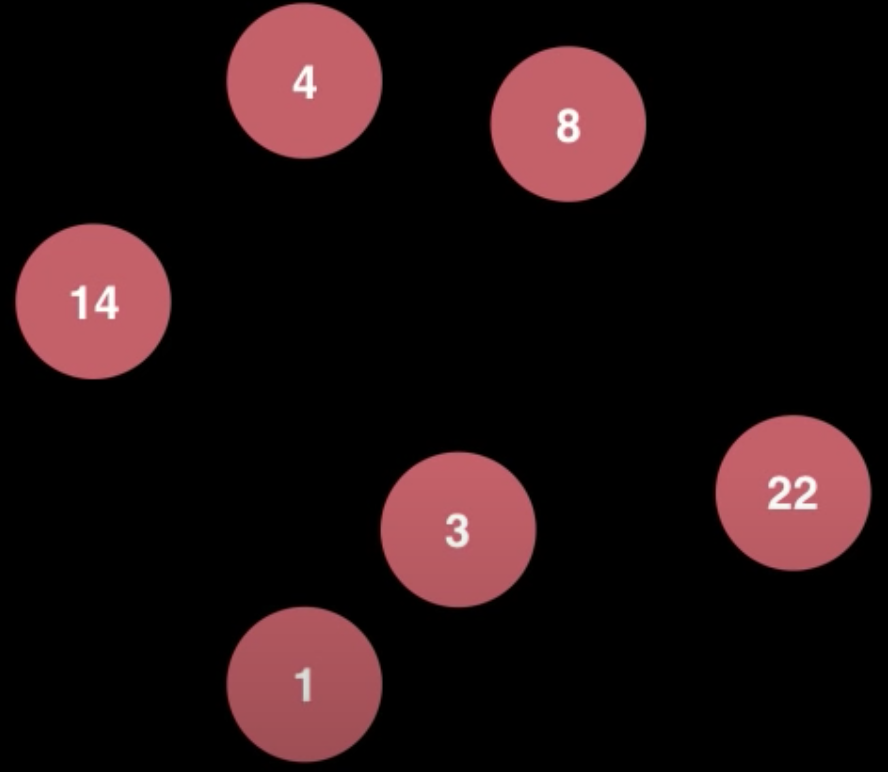
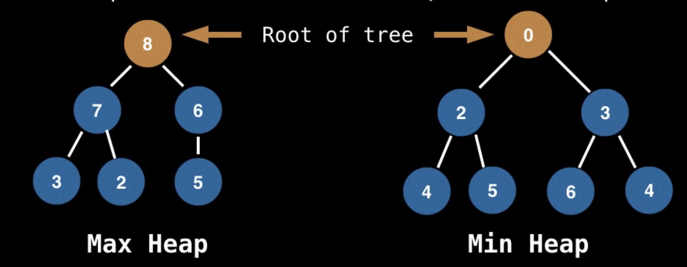

## Priority Queue

### What is a Priority Queue?

A Priority Queue is an Abstract Data Type (ADT that operates similar to a normal queue except that **each element has a certain priority**. The priority of the elements in the priority queue determine the order in which elements are removed from the PQ.

**Note**: Priority Queues only support **comparable data**, meaning the data inserted into the priority queue must be able to be ordered in some way either from least to greatest or greatest to least. This is so that we are able to assign relative priorities to each element.

Suppose all these values are inserted into a PQ with an ordering imposed on the numbers to be from lease to greatest.

**Instructions**

- `poll()` - 1
- `add(2)`
- `poll()` - 2
- `add(4)`
- `poll()` - 3
- `add(5)`
- `add(9)`
- poll rest - 4 4 5 8 9 14 22

### What is a Heap?

A heap is a **tree** based DS that satisfies the **heap invariant** (also called the heap property): If A is a parent node of B then A is ordered with respect to B for all nodes A,B in the heap.

### When and Where is a PQ Used?

- Used in certain implementations of Djikstra's shortest path algorithm
- Anytime you need to dynamically fetch the "next best" or "next worst" element
- Used in Huffman coding
- Best First Search algorithms such as A\* use PQs to continuously grab the next most promising node.
- Used by Minimum Spanning Tree (MST) algorithm

### Complexity - PQ With binary heap

Binary Heap construction - O(n)
Polling - O(logn)
Peeking - O(1)
Adding - O(logn)

Naive Removing - O(n)
Advanced Removing with hash tables - O(logn)
Naive contains - O(n)
Contains check with hash table - O(1)
